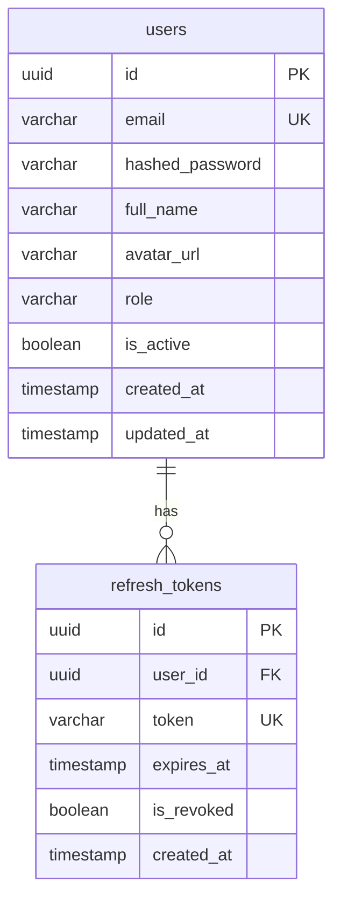

# Technical Analysis: Autenticacion (Fase 1)

> Platziflix - Plataforma de video streaming educativo
> Fase: 1 de 6
> Semana estimada: 2
> Dependencias: Fase 0 (Infraestructura Base)
>
> **Agentes asignados**:
> - `@backend` — Modelos User/RefreshToken, security (JWT, bcrypt), AuthService, UserService, deps auth, rate limiting
> - `@frontend` — Login/Register pages, auth store (Zustand), useAuth hook, middleware redirect, refresh interceptor

---

## Problema

Los usuarios necesitan registrarse, autenticarse y mantener sesiones seguras. El sistema debe soportar dos roles (user, admin) con JWT stateless para el 99% de requests y refresh tokens revocables almacenados en BD para renovacion y logout seguro.

## Impacto Arquitectonico

- **Backend**: Modelos User y RefreshToken, security utilities (hash, JWT), AuthService, UserService, dependencias de autenticacion (`get_current_user`, `require_role`)
- **Frontend**: Paginas de login/registro, store de autenticacion (Zustand), middleware de redirect, interceptor de refresh automatico
- **Database**: Tablas `users` y `refresh_tokens` con indices para busqueda por email y token
- **Security**: bcrypt para passwords, JWT HS256, refresh token en cookie HttpOnly, rate limiting en login
- **Performance**: Validacion JWT stateless (solo verifica firma), stateful solo en refresh

---

## Solucion Propuesta

### Database Schema



#### SQLAlchemy Models

```python
# backend/app/models/user.py
from sqlalchemy import Column, String, Boolean, Index
from sqlalchemy.orm import relationship
from app.models.base import Base, UUIDPrimaryKeyMixin, TimestampMixin


class User(Base, UUIDPrimaryKeyMixin, TimestampMixin):
    __tablename__ = "users"

    email = Column(String(255), unique=True, nullable=False, index=True)
    hashed_password = Column(String(255), nullable=False)
    full_name = Column(String(255), nullable=False)
    avatar_url = Column(String(512), nullable=True)
    role = Column(String(20), nullable=False, default="user")  # user, admin
    is_active = Column(Boolean, default=True, nullable=False)

    # Relationships
    refresh_tokens = relationship(
        "RefreshToken", back_populates="user", cascade="all, delete-orphan"
    )

    __table_args__ = (
        Index("ix_users_role_active", "role", "is_active"),
    )
```

```python
# backend/app/models/auth.py
from datetime import datetime
from sqlalchemy import Column, String, Boolean, DateTime, ForeignKey, Index
from sqlalchemy.dialects.postgresql import UUID
from sqlalchemy.orm import relationship
from app.models.base import Base, UUIDPrimaryKeyMixin


class RefreshToken(Base, UUIDPrimaryKeyMixin):
    __tablename__ = "refresh_tokens"

    user_id = Column(
        UUID(as_uuid=True), ForeignKey("users.id", ondelete="CASCADE"), nullable=False
    )
    token = Column(String(512), unique=True, nullable=False, index=True)
    expires_at = Column(DateTime, nullable=False)
    is_revoked = Column(Boolean, default=False, nullable=False)
    created_at = Column(DateTime, default=datetime.utcnow, nullable=False)

    # Relationships
    user = relationship("User", back_populates="refresh_tokens")

    __table_args__ = (
        Index("ix_refresh_tokens_user_revoked", "user_id", "is_revoked"),
        Index("ix_refresh_tokens_expires", "expires_at"),
    )
```

### Indices

| Tabla | Indice | Columnas | Justificacion |
|-------|--------|----------|---------------|
| users | ix_users_email (unique) | email | Login por email |
| users | ix_users_role_active | role, is_active | Filtrar usuarios por rol |
| refresh_tokens | ix_refresh_tokens_token (unique) | token | Busqueda de token en refresh |
| refresh_tokens | ix_refresh_tokens_user_revoked | user_id, is_revoked | Revocar tokens por usuario |
| refresh_tokens | ix_refresh_tokens_expires | expires_at | Limpieza de tokens expirados |

### API Contracts

**Base URL**: `/api/v1`

#### POST `/auth/register` -- Registro de usuario

```
Request Body:
{
  "email": "user@example.com",          // string, required, valid email
  "password": "SecurePass123!",          // string, required, min 8 chars
  "full_name": "Juan Perez"             // string, required, min 2 chars
}

Response 201:
{
  "id": "uuid",
  "email": "user@example.com",
  "full_name": "Juan Perez",
  "role": "user",
  "created_at": "2026-04-02T10:00:00Z"
}

Errors:
  409 CONFLICT         - Email ya registrado
  422 VALIDATION_ERROR - Datos invalidos
```

#### POST `/auth/login` -- Inicio de sesion

```
Request Body:
{
  "email": "user@example.com",
  "password": "SecurePass123!"
}

Response 200:
{
  "access_token": "eyJ...",
  "token_type": "bearer",
  "expires_in": 900
}
+ Set-Cookie: refresh_token=xxx; HttpOnly; Secure; SameSite=Strict; Path=/api/v1/auth; Max-Age=604800

Errors:
  401 UNAUTHORIZED - Credenciales invalidas
  403 FORBIDDEN    - Cuenta desactivada
```

#### POST `/auth/refresh` -- Renovar access token

```
Request: Cookie refresh_token (automatico)

Response 200:
{
  "access_token": "eyJ...",
  "token_type": "bearer",
  "expires_in": 900
}

Errors:
  401 UNAUTHORIZED - Refresh token invalido o expirado
```

#### POST `/auth/logout` -- Cerrar sesion

```
Request: Cookie refresh_token + Authorization header

Response 204: (sin body)

Errors:
  401 UNAUTHORIZED
```

#### POST `/auth/change-password` -- Cambiar contrasena [Auth required]

```
Request Body:
{
  "current_password": "OldPass123!",
  "new_password": "NewSecure456!"
}

Response 200:
{
  "message": "Password actualizado exitosamente"
}

Errors:
  401 UNAUTHORIZED     - No autenticado
  422 VALIDATION_ERROR - Password actual incorrecto o nuevo password invalido
```

#### GET `/users/me` -- Perfil del usuario actual [Auth required]

```
Response 200:
{
  "id": "uuid",
  "email": "user@example.com",
  "full_name": "Juan Perez",
  "avatar_url": "https://...",
  "role": "user",
  "is_active": true,
  "subscription": null,
  "created_at": "2026-04-02T10:00:00Z"
}
```

#### PATCH `/users/me` -- Actualizar perfil [Auth required]

```
Request Body (todos opcionales):
{
  "full_name": "Juan A. Perez",
  "avatar_url": "https://..."
}

Response 200: { ...usuario actualizado }

Errors:
  401 UNAUTHORIZED
  422 VALIDATION_ERROR
```

### Service Layer

```python
# backend/app/services/auth_service.py
class AuthService:
    def __init__(self, db: AsyncSession):
        self.db = db
        self.user_repo = UserRepository(db)
        self.token_repo = RefreshTokenRepository(db)

    async def register(self, data: RegisterRequest) -> User
    async def login(self, data: LoginRequest) -> tuple[str, str]  # access, refresh
    async def refresh(self, refresh_token: str) -> str  # new access token
    async def logout(self, refresh_token: str) -> None
    async def change_password(self, user_id: UUID, data: ChangePasswordRequest) -> None
```

```python
# backend/app/services/user_service.py
class UserService:
    def __init__(self, db: AsyncSession):
        self.db = db
        self.user_repo = UserRepository(db)

    async def get_profile(self, user_id: UUID) -> User
    async def update_profile(self, user_id: UUID, data: UserUpdate) -> User
```

### Dependencias de Autenticacion

```python
# backend/app/api/deps.py
from fastapi import Depends, HTTPException, status
from fastapi.security import HTTPBearer, HTTPAuthorizationCredentials

security = HTTPBearer()

async def get_current_user(
    credentials: HTTPAuthorizationCredentials = Depends(security),
    db: AsyncSession = Depends(get_db),
) -> User:
    """Decodifica JWT y retorna el usuario. Lanza 401 si invalido."""

async def get_current_active_user(
    user: User = Depends(get_current_user),
) -> User:
    """Verifica que el usuario este activo. Lanza 403 si desactivado."""

def require_role(role: str):
    """Dependency factory: verifica que el usuario tenga el rol especificado."""
    async def check_role(user: User = Depends(get_current_active_user)) -> User:
        if user.role != role:
            raise HTTPException(status_code=403, detail="Permisos insuficientes")
        return user
    return check_role
```

### Security: JWT Strategy

```
Decisiones:
- Access token: JWT HS256, 15 min de vida, viaja en header Authorization: Bearer
- Refresh token: UUID opaco, 7 dias, almacenado en BD, viaja en cookie HttpOnly
- Al hacer login: se emite access + refresh, se guarda refresh en BD
- Al hacer refresh: se verifica en BD, se emite nuevo access
- Al hacer logout: se revoca el refresh token en BD
- Al cambiar password: se revocan TODOS los refresh tokens del usuario
- Rate limit en login: 5 intentos en 15 min por IP
```

### Pydantic Schemas

```python
# backend/app/schemas/auth.py
from pydantic import BaseModel, EmailStr, Field


class RegisterRequest(BaseModel):
    email: EmailStr
    password: str = Field(..., min_length=8, max_length=128)
    full_name: str = Field(..., min_length=2, max_length=255)


class LoginRequest(BaseModel):
    email: EmailStr
    password: str


class TokenResponse(BaseModel):
    access_token: str
    token_type: str = "bearer"
    expires_in: int


class ChangePasswordRequest(BaseModel):
    current_password: str
    new_password: str = Field(..., min_length=8, max_length=128)
```

```python
# backend/app/schemas/user.py
from uuid import UUID
from datetime import datetime
from typing import Optional
from pydantic import BaseModel, Field


class UserResponse(BaseModel):
    id: UUID
    email: str
    full_name: str
    avatar_url: Optional[str]
    role: str
    is_active: bool
    created_at: datetime

    model_config = {"from_attributes": True}


class UserUpdate(BaseModel):
    full_name: Optional[str] = Field(None, min_length=2, max_length=255)
    avatar_url: Optional[str] = Field(None, max_length=512)
```

---

## Checklist de Implementacion

### Backend
- [ ] Modelo `User` + migracion Alembic
- [ ] Modelo `RefreshToken` + migracion Alembic
- [ ] `core/security.py` (hash_password, verify_password, create_access_token, decode_access_token)
- [ ] `UserRepository` (create, get_by_email, get_by_id, update)
- [ ] `RefreshTokenRepository` (create, get_by_token, revoke, revoke_all_for_user)
- [ ] `AuthService` (register, login, refresh, logout, change_password)
- [ ] `UserService` (get_profile, update_profile)
- [ ] `api/deps.py` (get_current_user, get_current_active_user, require_role)
- [ ] Schemas Pydantic: auth.py, user.py
- [ ] Router `/auth/*` (register, login, refresh, logout, change-password)
- [ ] Router `/users/me` (GET, PATCH)
- [ ] Rate limiting en login (5 req / 15 min por IP)
- [ ] Tests unitarios: AuthService
- [ ] Tests integracion: endpoints auth completos

### Frontend
- [ ] Pagina `/login` con LoginForm
- [ ] Pagina `/register` con RegisterForm
- [ ] `lib/api/auth.ts` (login, register, refresh)
- [ ] `stores/auth-store.ts` (Zustand: user state, tokens)
- [ ] `hooks/useAuth.ts` (login, logout, isAuthenticated)
- [ ] `middleware.ts` (redirect si no autenticado para rutas protegidas)
- [ ] Interceptor de refresh token automatico en `client.ts`

---

## Criterio de Completitud

Un usuario puede registrarse, hacer login, ver su perfil en `/users/me`, y el token se renueva automaticamente cuando expira el access token.
