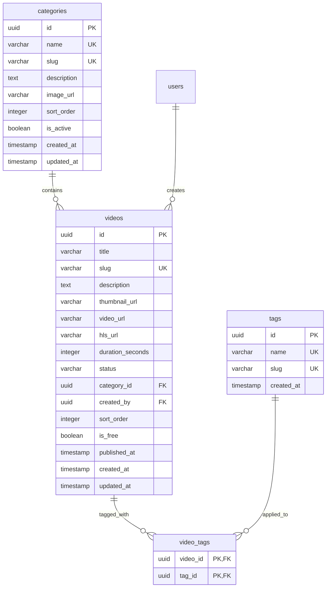

# Technical Analysis: Catalogo de Videos y Categorias (Fase 2)

> Platziflix - Plataforma de video streaming educativo
> Fase: 2 de 6
> Semana estimada: 3
> Dependencias: Fase 1 (Autenticacion - necesita modelo User para `created_by`)
>
> **Agentes asignados**:
> - `@backend` — Modelos Category/Video/Tag, repositories con full-text search y filtros, services de catalogo, endpoints publicos
> - `@frontend` — Home con VideoGrid, VideoCard, SearchBar, CategoryFilter, paginas de categoria y detalle de video

---

## Problema

Los usuarios necesitan descubrir contenido: navegar un catalogo de videos organizado por categorias, buscar por texto libre, filtrar por tags, y ver el detalle de cada video. Esta es la funcionalidad core de la plataforma — sin catalogo, no hay producto.

## Impacto Arquitectonico

- **Backend**: Modelos Category, Video, Tag + tabla pivot video_tags. Repositories con queries de busqueda full-text, filtros compuestos y paginacion. Services de catalogo.
- **Frontend**: Pagina home con grid de videos, paginas de categoria, detalle de video (sin reproductor aun), barra de busqueda, filtros.
- **Database**: 4 tablas nuevas, full-text search con `tsvector` nativo de PostgreSQL, multiples indices compuestos para queries de listado.
- **Security**: Endpoints publicos (sin auth), pero el detalle de video puede incluir info contextual del usuario autenticado.
- **Performance**: Busqueda full-text con GIN index, indices compuestos para filtros, paginacion offset/limit.

---

## Solucion Propuesta

### Database Schema



#### SQLAlchemy Models

```python
# backend/app/models/category.py
from sqlalchemy import Column, String, Text, Integer, Boolean, Index
from sqlalchemy.orm import relationship
from app.models.base import Base, UUIDPrimaryKeyMixin, TimestampMixin


class Category(Base, UUIDPrimaryKeyMixin, TimestampMixin):
    __tablename__ = "categories"

    name = Column(String(100), unique=True, nullable=False)
    slug = Column(String(120), unique=True, nullable=False, index=True)
    description = Column(Text, nullable=True)
    image_url = Column(String(512), nullable=True)
    sort_order = Column(Integer, default=0, nullable=False)
    is_active = Column(Boolean, default=True, nullable=False)

    videos = relationship("Video", back_populates="category")

    __table_args__ = (
        Index("ix_categories_active_sort", "is_active", "sort_order"),
    )
```

```python
# backend/app/models/video.py
from sqlalchemy import (
    Column, String, Text, Integer, Boolean, DateTime, ForeignKey, Index
)
from sqlalchemy.dialects.postgresql import UUID
from sqlalchemy.orm import relationship
from app.models.base import Base, UUIDPrimaryKeyMixin, TimestampMixin


class Video(Base, UUIDPrimaryKeyMixin, TimestampMixin):
    __tablename__ = "videos"

    title = Column(String(255), nullable=False)
    slug = Column(String(280), unique=True, nullable=False, index=True)
    description = Column(Text, nullable=True)
    thumbnail_url = Column(String(512), nullable=True)
    video_url = Column(String(512), nullable=True)
    hls_url = Column(String(512), nullable=True)
    duration_seconds = Column(Integer, nullable=True)
    status = Column(String(20), nullable=False, default="draft")
    category_id = Column(
        UUID(as_uuid=True), ForeignKey("categories.id", ondelete="SET NULL"), nullable=True
    )
    created_by = Column(
        UUID(as_uuid=True), ForeignKey("users.id", ondelete="SET NULL"), nullable=True
    )
    sort_order = Column(Integer, default=0, nullable=False)
    is_free = Column(Boolean, default=False, nullable=False)
    published_at = Column(DateTime, nullable=True)

    category = relationship("Category", back_populates="videos")
    created_by_user = relationship("User", back_populates="created_videos")
    tags = relationship("Tag", secondary="video_tags", back_populates="videos")

    __table_args__ = (
        Index("ix_videos_category_status", "category_id", "status"),
        Index("ix_videos_status_published", "status", "published_at"),
        Index("ix_videos_free_status", "is_free", "status"),
    )
```

```python
# backend/app/models/tag.py
from datetime import datetime
from sqlalchemy import Column, String, DateTime, Table, ForeignKey
from sqlalchemy.dialects.postgresql import UUID
from sqlalchemy.orm import relationship
from app.models.base import Base, UUIDPrimaryKeyMixin


video_tags = Table(
    "video_tags",
    Base.metadata,
    Column("video_id", UUID(as_uuid=True), ForeignKey("videos.id", ondelete="CASCADE"), primary_key=True),
    Column("tag_id", UUID(as_uuid=True), ForeignKey("tags.id", ondelete="CASCADE"), primary_key=True),
)


class Tag(Base, UUIDPrimaryKeyMixin):
    __tablename__ = "tags"

    name = Column(String(50), unique=True, nullable=False)
    slug = Column(String(60), unique=True, nullable=False, index=True)
    created_at = Column(DateTime, default=datetime.utcnow, nullable=False)

    videos = relationship("Video", secondary=video_tags, back_populates="tags")
```

### Full-Text Search (PostgreSQL)

```sql
-- Migracion: agregar columna de busqueda full-text
ALTER TABLE videos ADD COLUMN search_vector tsvector
    GENERATED ALWAYS AS (
        setweight(to_tsvector('spanish', coalesce(title, '')), 'A') ||
        setweight(to_tsvector('spanish', coalesce(description, '')), 'B')
    ) STORED;

CREATE INDEX ix_videos_search ON videos USING GIN (search_vector);
```

### Indices

| Tabla | Indice | Columnas | Justificacion |
|-------|--------|----------|---------------|
| categories | ix_categories_slug (unique) | slug | Busqueda por slug en URL |
| categories | ix_categories_active_sort | is_active, sort_order | Listado ordenado de categorias activas |
| videos | ix_videos_slug (unique) | slug | Busqueda por slug en URL |
| videos | ix_videos_category_status | category_id, status | Filtrar videos por categoria y estado |
| videos | ix_videos_status_published | status, published_at | Listado cronologico de publicados |
| videos | ix_videos_free_status | is_free, status | Filtrar contenido gratuito |
| videos | ix_videos_search (GIN) | search_vector | Busqueda full-text |
| tags | ix_tags_slug (unique) | slug | Busqueda por slug |
| video_tags | PK compuesta | video_id, tag_id | Relacion M:N |

### API Contracts

#### GET `/videos` -- Listar videos publicados

```
Query Parameters:
  ?category=desarrollo-web              // string, filtrar por slug de categoria
  &search=python                        // string, busqueda full-text
  &tag=python                           // string, filtrar por tag slug
  &is_free=true                         // boolean, solo videos gratuitos
  &sort=recent|popular|oldest           // string, default: recent
  &offset=0                             // int, default: 0
  &limit=20                             // int, default: 20, max: 100

Response 200:
{
  "items": [
    {
      "id": "uuid",
      "title": "Introduccion a Python",
      "slug": "introduccion-a-python",
      "description": "Aprende los fundamentos...",
      "thumbnail_url": "https://...",
      "duration_seconds": 1800,
      "is_free": true,
      "category": {
        "id": "uuid",
        "name": "Desarrollo Web",
        "slug": "desarrollo-web"
      },
      "tags": [
        {"id": "uuid", "name": "Python", "slug": "python"}
      ],
      "published_at": "2026-04-01T10:00:00Z"
    }
  ],
  "total": 150,
  "offset": 0,
  "limit": 20
}
```

#### GET `/videos/{slug}` -- Detalle de un video

```
Response 200:
{
  "id": "uuid",
  "title": "Introduccion a Python",
  "slug": "introduccion-a-python",
  "description": "Aprende los fundamentos de Python...",
  "thumbnail_url": "https://...",
  "video_url": "https://presigned-url...",    // null si requiere suscripcion
  "hls_url": "https://presigned-hls-url...",  // null si requiere suscripcion
  "duration_seconds": 1800,
  "is_free": true,
  "category": { "id": "uuid", "name": "Desarrollo Web", "slug": "desarrollo-web" },
  "tags": [ {"id": "uuid", "name": "Python", "slug": "python"} ],
  "published_at": "2026-04-01T10:00:00Z",
  "user_progress": {                           // null si no autenticado
    "watched_seconds": 600,
    "is_completed": false
  }
}

Errors:
  404 RESOURCE_NOT_FOUND
  402 PAYMENT_REQUIRED  - Video de pago, usuario sin suscripcion activa
```

#### GET `/categories` -- Listar categorias activas

```
Query Parameters:
  ?include_count=true                   // boolean, incluir conteo de videos

Response 200:
{
  "items": [
    {
      "id": "uuid",
      "name": "Desarrollo Web",
      "slug": "desarrollo-web",
      "description": "Cursos de desarrollo web...",
      "image_url": "https://...",
      "video_count": 45
    }
  ],
  "total": 8
}
```

#### GET `/categories/{slug}` -- Detalle de categoria

```
Response 200:
{
  "id": "uuid",
  "name": "Desarrollo Web",
  "slug": "desarrollo-web",
  "description": "Cursos de desarrollo web...",
  "image_url": "https://..."
}

Errors:
  404 RESOURCE_NOT_FOUND
```

#### GET `/tags` -- Listar tags

```
Query Parameters:
  ?search=pyth                          // string, busqueda por prefijo

Response 200:
{
  "items": [
    {"id": "uuid", "name": "Python", "slug": "python"},
    {"id": "uuid", "name": "JavaScript", "slug": "javascript"}
  ],
  "total": 25
}
```

### Service Layer

```python
# backend/app/services/video_service.py
class VideoService:
    def __init__(self, db: AsyncSession):
        self.video_repo = VideoRepository(db)
        self.category_repo = CategoryRepository(db)

    async def list_published(self, params: VideoListParams) -> PaginatedResponse
    async def get_by_slug(self, slug: str) -> VideoDetail

# backend/app/services/category_service.py
class CategoryService:
    def __init__(self, db: AsyncSession):
        self.category_repo = CategoryRepository(db)

    async def list_active(self, include_count: bool = False) -> list[Category]
    async def get_by_slug(self, slug: str) -> Category

# backend/app/services/tag_service.py
class TagService:
    def __init__(self, db: AsyncSession):
        self.tag_repo = TagRepository(db)

    async def list_tags(self, search: str = None) -> list[Tag]
```

### Pydantic Schemas

```python
# backend/app/schemas/video.py
class VideoListItem(BaseModel):
    id: UUID
    title: str
    slug: str
    description: Optional[str]
    thumbnail_url: Optional[str]
    duration_seconds: Optional[int]
    is_free: bool
    category: Optional[CategoryBrief]
    tags: Sequence[TagBrief]
    published_at: Optional[datetime]

    model_config = {"from_attributes": True}


class VideoDetail(VideoListItem):
    video_url: Optional[str] = None
    hls_url: Optional[str] = None
    user_progress: Optional[UserProgress] = None


class VideoListParams(PaginationParams):
    category: Optional[str] = None
    search: Optional[str] = None
    tag: Optional[str] = None
    is_free: Optional[bool] = None
    sort: str = Field(default="recent", pattern="^(recent|popular|oldest)$")
```

---

## Checklist de Implementacion

### Backend
- [ ] Modelo `Category` + migracion
- [ ] Modelo `Video` + migracion
- [ ] Modelo `Tag` + tabla `video_tags` + migracion
- [ ] Migracion para full-text search (`search_vector` + indice GIN)
- [ ] `CategoryRepository` (CRUD, get_by_slug, list_active, count_videos)
- [ ] `VideoRepository` (list_published, get_by_slug, search_fulltext, filter_by_category, filter_by_tag)
- [ ] `TagRepository` (CRUD, search_by_prefix)
- [ ] `CategoryService`, `VideoService`, `TagService`
- [ ] Schemas Pydantic: video.py, category.py, tag.py
- [ ] Schema `VideoListParams` con filtros y sort
- [ ] Routers: `GET /videos`, `GET /videos/{slug}`, `GET /categories`, `GET /categories/{slug}`, `GET /tags`
- [ ] Agregar relationship `created_videos` al modelo `User` existente
- [ ] Tests unitarios: VideoService con filtros y busqueda
- [ ] Tests integracion: endpoints de catalogo

### Frontend
- [ ] Pagina home (`/`) con grid de videos
- [ ] Componente `VideoCard` (thumbnail, titulo, duracion, categoria)
- [ ] Componente `VideoGrid` (grid responsive de VideoCards)
- [ ] Componente `CategoryFilter` (sidebar o tabs de categorias)
- [ ] Componente `SearchBar` (busqueda con debounce)
- [ ] Pagina de categoria (`/categories/[slug]`)
- [ ] Pagina de detalle de video (`/videos/[slug]`) -- sin reproductor aun, solo info
- [ ] `lib/api/videos.ts` (listVideos, getVideo)
- [ ] `lib/api/categories.ts` (listCategories, getCategory)
- [ ] `hooks/useVideos.ts` con busqueda y filtros
- [ ] Paginacion (infinite scroll o paginacion clasica)
- [ ] `types/video.ts`, `types/category.ts`

---

## Criterio de Completitud

Un usuario puede navegar el catalogo en la pagina principal, buscar videos por texto, filtrar por categoria y tags, y ver la pagina de detalle de un video con toda su informacion (sin reproductor aun).
