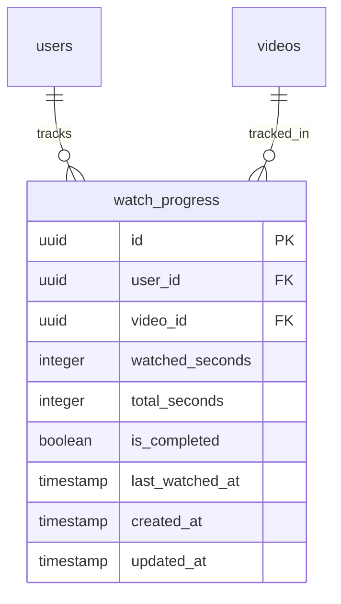

# Technical Analysis: Reproductor y Tracking de Progreso (Fase 4)

> Platziflix - Plataforma de video streaming educativo
> Fase: 4 de 6
> Semana estimada: 5
> Dependencias: Fase 2 (Videos), Fase 1 (Auth para tracking)
>
> **Agentes asignados**:
> - `@backend` — Modelo WatchProgress, repository upsert, service con logica is_completed 90%, endpoints progreso, logica acceso video (free vs suscripcion)
> - `@frontend` — VideoPlayer con hls.js, controles custom, debounce tracking 15s, resume, barra progreso en VideoCard, pagina historial

---

## Problema

Los usuarios necesitan reproducir videos con streaming adaptativo (HLS) y que la plataforma recuerde exactamente donde se quedaron. El reproductor debe soportar resume automatico, tracking de progreso en tiempo real (debounced), y marcado automatico de videos completados. Ademas, los videos de pago deben estar protegidos — solo accesibles con suscripcion activa.

## Impacto Arquitectonico

- **Backend**: Modelo WatchProgress con upsert, logica de is_completed automatica (90% visto), generacion de presigned URLs de streaming, verificacion de acceso (free vs. suscripcion)
- **Frontend**: Componente VideoPlayer con hls.js, controles custom, evento timeupdate con debounce enviando progreso al backend, barra de progreso en VideoCards
- **Database**: Tabla `watch_progress` con unique constraint user_id+video_id, indices para historial y filtro por completados
- **Security**: Presigned URLs con expiracion de 4h para videos. Verificacion de suscripcion antes de entregar URLs de streaming
- **Performance**: Debounce de 15 seg en tracking para no saturar el backend. Upsert para evitar duplicados.

---

## Solucion Propuesta

### Database Schema



#### SQLAlchemy Model

```python
# backend/app/models/watch_progress.py
from sqlalchemy import Column, Integer, Boolean, DateTime, ForeignKey, Index, UniqueConstraint
from sqlalchemy.dialects.postgresql import UUID
from sqlalchemy.orm import relationship
from app.models.base import Base, UUIDPrimaryKeyMixin, TimestampMixin


class WatchProgress(Base, UUIDPrimaryKeyMixin, TimestampMixin):
    __tablename__ = "watch_progress"

    user_id = Column(UUID(as_uuid=True), ForeignKey("users.id", ondelete="CASCADE"), nullable=False)
    video_id = Column(UUID(as_uuid=True), ForeignKey("videos.id", ondelete="CASCADE"), nullable=False)
    watched_seconds = Column(Integer, default=0, nullable=False)
    total_seconds = Column(Integer, default=0, nullable=False)
    is_completed = Column(Boolean, default=False, nullable=False)
    last_watched_at = Column(DateTime, nullable=False)

    user = relationship("User", back_populates="watch_progress")
    video = relationship("Video", back_populates="watch_progress")

    __table_args__ = (
        UniqueConstraint("user_id", "video_id", name="uq_watch_progress_user_video"),
        Index("ix_watch_progress_user", "user_id"),
        Index("ix_watch_progress_user_completed", "user_id", "is_completed"),
        Index("ix_watch_progress_user_last_watched", "user_id", "last_watched_at"),
    )
```

### Indices

| Tabla | Indice | Columnas | Justificacion |
|-------|--------|----------|---------------|
| watch_progress | uq_watch_progress_user_video | user_id, video_id | Un registro por usuario-video (upsert) |
| watch_progress | ix_watch_progress_user | user_id | Listado de historial |
| watch_progress | ix_watch_progress_user_completed | user_id, is_completed | Filtrar videos completados vs en progreso |
| watch_progress | ix_watch_progress_user_last_watched | user_id, last_watched_at | Ordenar historial por ultimo visto |

### API Contracts

#### POST `/progress` -- Actualizar progreso de un video [Auth required]

```
Request Body:
{
  "video_id": "uuid",
  "watched_seconds": 900,
  "total_seconds": 1800
}

Response 200:
{
  "video_id": "uuid",
  "watched_seconds": 900,
  "total_seconds": 1800,
  "is_completed": false,
  "last_watched_at": "2026-04-02T14:30:00Z"
}

Notas:
  - Upsert: crea si no existe, actualiza si ya existe
  - is_completed se marca true automaticamente cuando watched_seconds >= total_seconds * 0.9
```

#### GET `/progress` -- Historial de visualizacion del usuario [Auth required]

```
Query Parameters:
  ?completed=false                      // boolean, filtrar por completados
  &sort=recent|oldest                   // string, default: recent
  &offset=0
  &limit=20

Response 200:
{
  "items": [
    {
      "video": {
        "id": "uuid",
        "title": "Introduccion a Python",
        "slug": "introduccion-a-python",
        "thumbnail_url": "https://...",
        "duration_seconds": 1800
      },
      "watched_seconds": 900,
      "total_seconds": 1800,
      "is_completed": false,
      "last_watched_at": "2026-04-02T14:30:00Z"
    }
  ],
  "total": 35,
  "offset": 0,
  "limit": 20
}
```

#### GET `/progress/{video_id}` -- Progreso de un video especifico [Auth required]

```
Response 200:
{
  "video_id": "uuid",
  "watched_seconds": 900,
  "total_seconds": 1800,
  "is_completed": false,
  "last_watched_at": "2026-04-02T14:30:00Z"
}

Errors:
  404 RESOURCE_NOT_FOUND - No hay progreso registrado
```

### Service Layer

```python
# backend/app/services/watch_progress_service.py
class WatchProgressService:
    def __init__(self, db: AsyncSession):
        self.progress_repo = WatchProgressRepository(db)

    async def update_progress(
        self, user_id: UUID, data: ProgressUpdate
    ) -> WatchProgress:
        """
        Upsert: crea o actualiza progreso.
        Marca is_completed=True si watched_seconds >= total_seconds * 0.9
        """

    async def get_history(
        self, user_id: UUID, params: ProgressListParams
    ) -> PaginatedResponse:
        """Historial paginado con video info, ordenado por last_watched_at."""

    async def get_for_video(
        self, user_id: UUID, video_id: UUID
    ) -> Optional[WatchProgress]:
        """Progreso de un video especifico."""
```

### Logica de Acceso a Videos

```python
# Logica integrada en VideoService.get_by_slug()
async def get_by_slug(self, slug: str, current_user: Optional[User] = None) -> VideoDetail:
    video = await self.video_repo.get_by_slug(slug)
    if not video:
        raise NotFoundError("Video", slug)

    result = VideoDetail.model_validate(video)

    # Si el video es de pago, verificar suscripcion
    if not video.is_free:
        if not current_user:
            result.video_url = None
            result.hls_url = None
        else:
            has_subscription = await self.subscription_repo.has_active(current_user.id)
            if not has_subscription:
                result.video_url = None
                result.hls_url = None
            else:
                # Generar presigned URLs
                result.video_url = self.storage.generate_video_stream_url(video.video_url)
                result.hls_url = self.storage.generate_video_stream_url(video.hls_url)

    # Si esta autenticado, incluir progreso
    if current_user:
        progress = await self.progress_repo.get_for_user_video(current_user.id, video.id)
        if progress:
            result.user_progress = UserProgress(
                watched_seconds=progress.watched_seconds,
                is_completed=progress.is_completed,
            )

    return result
```

### Frontend: VideoPlayer con HLS

```
Tecnologia: hls.js (libreria JavaScript para HLS en navegadores que no lo soportan nativamente)

Comportamiento del reproductor:
1. Al cargar la pagina de video:
   - Obtener detalle de video (incluye user_progress y presigned URLs)
   - Si hay user_progress.watched_seconds > 0, iniciar desde ese punto
   - Inicializar hls.js con la URL HLS

2. Durante reproduccion:
   - Cada 15 segundos (debounced), enviar POST /progress con:
     { video_id, watched_seconds: currentTime, total_seconds: duration }
   - Tambien enviar al pausar o al salir de la pagina (beforeunload)

3. Al completar:
   - Backend marca is_completed=true cuando watched_seconds >= 90% de duration

Controles:
  - Play/Pause
  - Seek bar con preview
  - Volumen
  - Fullscreen
  - Selector de calidad (adaptive bitrate)
  - Velocidad de reproduccion (0.5x, 1x, 1.25x, 1.5x, 2x)
```

### Pydantic Schemas

```python
# backend/app/schemas/watch_progress.py
from uuid import UUID
from datetime import datetime
from typing import Optional
from pydantic import BaseModel, Field


class ProgressUpdate(BaseModel):
    video_id: UUID
    watched_seconds: int = Field(..., ge=0)
    total_seconds: int = Field(..., ge=0)


class ProgressResponse(BaseModel):
    video_id: UUID
    watched_seconds: int
    total_seconds: int
    is_completed: bool
    last_watched_at: datetime

    model_config = {"from_attributes": True}


class ProgressWithVideo(BaseModel):
    video: VideoListItem  # referencia a schema de video
    watched_seconds: int
    total_seconds: int
    is_completed: bool
    last_watched_at: datetime


class ProgressListParams(PaginationParams):
    completed: Optional[bool] = None
    sort: str = Field(default="recent", pattern="^(recent|oldest)$")
```

---

## Checklist de Implementacion

### Backend
- [ ] Modelo `WatchProgress` + migracion Alembic
- [ ] `WatchProgressRepository` (upsert, get_for_user_video, list_history, filter_by_completed)
- [ ] `WatchProgressService` (update_progress con logica de is_completed al 90%)
- [ ] Schemas Pydantic: watch_progress.py
- [ ] Router: `POST /progress` (upsert)
- [ ] Router: `GET /progress` (historial paginado con filtros)
- [ ] Router: `GET /progress/{video_id}` (progreso especifico)
- [ ] Integrar logica de acceso en `VideoService.get_by_slug`: check suscripcion, generar presigned URLs
- [ ] Agregar `user_progress` al response de `GET /videos/{slug}` para usuarios autenticados
- [ ] Tests unitarios: WatchProgressService (upsert, is_completed logic)
- [ ] Tests integracion: endpoints de progreso

### Frontend
- [ ] Componente `VideoPlayer` con hls.js
  - [ ] Controles: play/pause, seek, volumen, fullscreen, calidad, velocidad
  - [ ] Resume desde ultimo punto visto
  - [ ] Evento `timeupdate` con debounce de 15 seg -> POST /progress
  - [ ] Enviar progreso al pausar y al salir (beforeunload)
- [ ] Barra de progreso visual en `VideoCard` (porcentaje visto)
- [ ] Pagina de historial (`/profile/history`) con lista de videos en progreso y completados
- [ ] `stores/player-store.ts` (estado del reproductor: playing, currentTime, quality)
- [ ] `lib/api/progress.ts` (updateProgress, getHistory, getVideoProgress)
- [ ] `hooks/useProgress.ts`
- [ ] Paywall visual: mensaje "Suscribete para ver este video" en videos de pago sin suscripcion

---

## Criterio de Completitud

Un usuario logueado puede reproducir un video con streaming HLS, pausar, salir de la pagina, volver, y el video reanuda exactamente donde lo dejo. El historial muestra los videos vistos con porcentaje de progreso. Los videos de pago muestran paywall si el usuario no tiene suscripcion.
