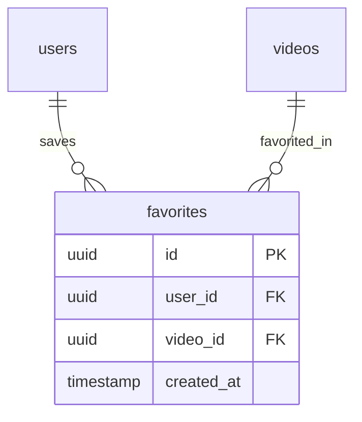

# Technical Analysis: Perfiles de Usuario y Favoritos (Fase 5)

> Platziflix - Plataforma de video streaming educativo
> Fase: 5 de 6
> Semana estimada: 6
> Dependencias: Fase 4 (Progreso), Fase 1 (Auth)
>
> **Agentes asignados**:
> - `@backend` — Modelo Favorite, repository add/remove/check, FavoriteService, endpoints favoritos, extension is_favorited en detalle video
> - `@frontend` — Pagina perfil, pagina favoritos, boton corazon con toggle optimista, edicion perfil, useFavoriteToggle hook

---

## Problema

Los usuarios necesitan un espacio personal donde gestionar su experiencia: guardar videos como favoritos para verlos despues, revisar su historial completo de visualizacion, y editar su perfil. El sistema de favoritos debe ser responsive (toggle optimista en UI) y no permitir duplicados.

## Impacto Arquitectonico

- **Backend**: Modelo Favorite con unique constraint, FavoriteRepository con operaciones add/remove/check, FavoriteService. Extension del detalle de video para incluir `is_favorited`.
- **Frontend**: Pagina de perfil con resumen, pagina de favoritos, pagina de historial (ya parcialmente en Fase 4), boton de favorito con toggle optimista en VideoCard y detalle.
- **Database**: Tabla `favorites` con unique constraint user_id+video_id, indices para listado cronologico.
- **Security**: Solo usuarios autenticados pueden gestionar favoritos. Un usuario solo ve sus propios favoritos.
- **Performance**: Toggle optimista en frontend (actualiza UI antes de respuesta del server). Unique constraint previene duplicados a nivel de BD.

---

## Solucion Propuesta

### Database Schema



#### SQLAlchemy Model

```python
# backend/app/models/favorite.py
from datetime import datetime
from sqlalchemy import Column, DateTime, ForeignKey, UniqueConstraint, Index
from sqlalchemy.dialects.postgresql import UUID
from sqlalchemy.orm import relationship
from app.models.base import Base, UUIDPrimaryKeyMixin


class Favorite(Base, UUIDPrimaryKeyMixin):
    __tablename__ = "favorites"

    user_id = Column(UUID(as_uuid=True), ForeignKey("users.id", ondelete="CASCADE"), nullable=False)
    video_id = Column(UUID(as_uuid=True), ForeignKey("videos.id", ondelete="CASCADE"), nullable=False)
    created_at = Column(DateTime, default=datetime.utcnow, nullable=False)

    user = relationship("User", back_populates="favorites")
    video = relationship("Video", back_populates="favorites")

    __table_args__ = (
        UniqueConstraint("user_id", "video_id", name="uq_favorites_user_video"),
        Index("ix_favorites_user", "user_id"),
        Index("ix_favorites_user_created", "user_id", "created_at"),
    )
```

### Indices

| Tabla | Indice | Columnas | Justificacion |
|-------|--------|----------|---------------|
| favorites | uq_favorites_user_video | user_id, video_id | Un favorito por usuario-video |
| favorites | ix_favorites_user | user_id | Listado de favoritos del usuario |
| favorites | ix_favorites_user_created | user_id, created_at | Listado cronologico de favoritos |

### API Contracts

#### POST `/favorites` -- Agregar video a favoritos [Auth required]

```
Request Body:
{
  "video_id": "uuid"
}

Response 201:
{
  "id": "uuid",
  "video_id": "uuid",
  "created_at": "2026-04-02T15:00:00Z"
}

Errors:
  404 RESOURCE_NOT_FOUND - Video no existe
  409 CONFLICT           - Ya esta en favoritos
```

#### DELETE `/favorites/{video_id}` -- Remover de favoritos [Auth required]

```
Response 204: (sin body)

Errors:
  404 RESOURCE_NOT_FOUND - No estaba en favoritos
```

#### GET `/favorites` -- Listar favoritos del usuario [Auth required]

```
Query Parameters:
  ?offset=0
  &limit=20

Response 200:
{
  "items": [
    {
      "id": "uuid",
      "video": {
        "id": "uuid",
        "title": "Introduccion a Python",
        "slug": "introduccion-a-python",
        "thumbnail_url": "https://...",
        "duration_seconds": 1800
      },
      "created_at": "2026-04-02T15:00:00Z"
    }
  ],
  "total": 12,
  "offset": 0,
  "limit": 20
}
```

### Extension del Detalle de Video

El endpoint `GET /videos/{slug}` se extiende para incluir `is_favorited` cuando el usuario esta autenticado:

```json
{
  "id": "uuid",
  "title": "...",
  "...": "...",
  "user_progress": { "watched_seconds": 600, "is_completed": false },
  "is_favorited": true
}
```

### Service Layer

```python
# backend/app/services/favorite_service.py
class FavoriteService:
    def __init__(self, db: AsyncSession):
        self.favorite_repo = FavoriteRepository(db)
        self.video_repo = VideoRepository(db)

    async def add_favorite(self, user_id: UUID, video_id: UUID) -> Favorite:
        """Agrega a favoritos. Lanza ConflictError si ya existe, NotFoundError si video no existe."""

    async def remove_favorite(self, user_id: UUID, video_id: UUID) -> None:
        """Remueve de favoritos. Lanza NotFoundError si no estaba."""

    async def list_favorites(
        self, user_id: UUID, params: PaginationParams
    ) -> PaginatedResponse:
        """Lista favoritos del usuario con info del video, ordenados por fecha de agregado."""

    async def is_favorited(self, user_id: UUID, video_id: UUID) -> bool:
        """Verifica si un video esta en favoritos del usuario."""
```

### Frontend: Toggle Optimista de Favoritos

```
Patron de toggle optimista:

1. Usuario hace click en boton de favorito (corazon)
2. UI actualiza inmediatamente (corazon relleno/vacio)
3. Se envia POST/DELETE al backend en background
4. Si el request falla:
   - Revertir el estado visual
   - Mostrar toast de error

Implementacion con hook:

const useFavoriteToggle = (videoId: string, initialState: boolean) => {
  const [isFavorited, setIsFavorited] = useState(initialState)
  const [isLoading, setIsLoading] = useState(false)

  const toggle = async () => {
    const previous = isFavorited
    setIsFavorited(!previous)  // Optimistic update

    try {
      if (previous) {
        await removeFavorite(videoId)
      } else {
        await addFavorite(videoId)
      }
    } catch {
      setIsFavorited(previous)  // Revert on error
      toast.error("Error al actualizar favorito")
    }
  }

  return { isFavorited, toggle, isLoading }
}
```

### Pagina de Perfil

```
/profile - Resumen del usuario:
  - Nombre, email, avatar
  - Boton editar perfil
  - Estadisticas: X videos vistos, Y completados, Z favoritos
  - Links a historial y favoritos
  - Info de suscripcion (si tiene)

/profile/favorites - Lista de videos favoritos con VideoGrid
/profile/history - Lista de videos vistos (de Fase 4) con progreso
```

### Pydantic Schemas

```python
# backend/app/schemas/favorite.py
from uuid import UUID
from datetime import datetime
from pydantic import BaseModel


class FavoriteCreate(BaseModel):
    video_id: UUID


class FavoriteResponse(BaseModel):
    id: UUID
    video_id: UUID
    created_at: datetime

    model_config = {"from_attributes": True}


class FavoriteWithVideo(BaseModel):
    id: UUID
    video: VideoListItem
    created_at: datetime
```

---

## Checklist de Implementacion

### Backend
- [ ] Modelo `Favorite` + migracion Alembic
- [ ] `FavoriteRepository` (add, remove, list_for_user, check_exists, count_for_user)
- [ ] `FavoriteService` (add_favorite, remove_favorite, list_favorites, is_favorited)
- [ ] Schemas Pydantic: favorite.py
- [ ] Router: `POST /favorites` (agregar)
- [ ] Router: `DELETE /favorites/{video_id}` (remover)
- [ ] Router: `GET /favorites` (listar paginado)
- [ ] Extender `GET /videos/{slug}` para incluir `is_favorited` para usuarios autenticados
- [ ] Agregar relationships `favorites` al modelo `User` y `Video` existentes
- [ ] Tests unitarios: FavoriteService (add, remove, duplicado, no encontrado)
- [ ] Tests integracion: endpoints de favoritos

### Frontend
- [ ] Pagina de perfil (`/profile/page.tsx`) con resumen y estadisticas
- [ ] Pagina de favoritos (`/profile/favorites/page.tsx`) con VideoGrid
- [ ] Completar pagina de historial (`/profile/history/page.tsx`) de Fase 4
- [ ] Boton de favorito (corazon) en `VideoCard`
- [ ] Boton de favorito (corazon) en pagina de detalle de video
- [ ] Hook `useFavoriteToggle` con toggle optimista
- [ ] Formulario de edicion de perfil (nombre, avatar) en `/profile`
- [ ] `lib/api/favorites.ts` (addFavorite, removeFavorite, listFavorites)
- [ ] `hooks/useFavorites.ts`
- [ ] `types/favorite.ts`

---

## Criterio de Completitud

Un usuario puede agregar y quitar videos de favoritos desde cualquier vista (catalogo y detalle), ver su lista de favoritos en `/profile/favorites`, editar su nombre y avatar en `/profile`, y navegar su historial completo en `/profile/history`.
