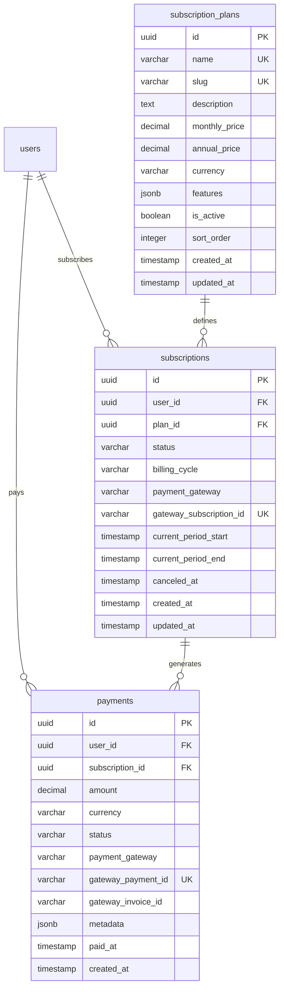

# Technical Analysis: Suscripciones y Pagos (Fase 6)

> Platziflix - Plataforma de video streaming educativo
> Fase: 6 de 6
> Semana estimada: 7-8
> Dependencias: Fase 1 (Auth), Fase 4 (para restringir acceso por suscripcion)
> Nota: Esta fase puede desarrollarse en paralelo con Fases 2-5
>
> **Agentes asignados**:
> - `@backend` — Modelos SubscriptionPlan/Subscription/Payment, integracion Stripe SDK, webhook con firma, services de suscripcion y pagos, middleware require_active_subscription
> - `@frontend` — Pagina planes, PlanCard, CheckoutForm con Stripe Elements, gestion suscripcion, historial pagos, paywall en videos

---

## Problema

Monetizar la plataforma: los usuarios deben poder elegir un plan de suscripcion, pagar con tarjeta via Stripe, y acceder a contenido premium mientras su suscripcion este activa. El sistema debe manejar renovaciones automaticas, cancelaciones, y estados de pago fallido, todo orquestado por webhooks de Stripe para garantizar consistencia.

## Impacto Arquitectonico

- **Backend**: Modelos SubscriptionPlan, Subscription, Payment. Integracion con Stripe SDK (crear Customer, PaymentIntent, Subscription). Webhook endpoint autenticado por firma de Stripe. Middleware `require_active_subscription` para proteger videos de pago.
- **Frontend**: Pagina de planes con precios, flujo de checkout con Stripe Elements, pagina de gestion de suscripcion (ver plan, cancelar), historial de pagos, paywall en videos de pago.
- **Database**: 3 tablas nuevas con indices para busqueda por usuario, estado, y reconciliacion con gateway.
- **Security**: Webhook autenticado por firma de Stripe (NO por JWT). Tokens de pago nunca almacenados (Stripe los maneja). Idempotencia en procesamiento de webhooks.
- **Performance**: Verificacion de suscripcion en cada request de video protegido — considerar cache en futuro.

---

## Solucion Propuesta

### Database Schema



#### SQLAlchemy Models

```python
# backend/app/models/subscription.py
from sqlalchemy import (
    Column, String, Text, Integer, Boolean, Numeric, DateTime,
    ForeignKey, Index
)
from sqlalchemy.dialects.postgresql import UUID, JSONB
from sqlalchemy.orm import relationship
from app.models.base import Base, UUIDPrimaryKeyMixin, TimestampMixin


class SubscriptionPlan(Base, UUIDPrimaryKeyMixin, TimestampMixin):
    __tablename__ = "subscription_plans"

    name = Column(String(100), unique=True, nullable=False)
    slug = Column(String(120), unique=True, nullable=False, index=True)
    description = Column(Text, nullable=True)
    monthly_price = Column(Numeric(10, 2), nullable=False)
    annual_price = Column(Numeric(10, 2), nullable=False)
    currency = Column(String(3), nullable=False, default="USD")
    features = Column(JSONB, nullable=True)  # ["feature1", "feature2"]
    is_active = Column(Boolean, default=True, nullable=False)
    sort_order = Column(Integer, default=0, nullable=False)

    subscriptions = relationship("Subscription", back_populates="plan")

    __table_args__ = (
        Index("ix_plans_active_sort", "is_active", "sort_order"),
    )


class Subscription(Base, UUIDPrimaryKeyMixin, TimestampMixin):
    __tablename__ = "subscriptions"

    user_id = Column(UUID(as_uuid=True), ForeignKey("users.id", ondelete="CASCADE"), nullable=False)
    plan_id = Column(UUID(as_uuid=True), ForeignKey("subscription_plans.id", ondelete="RESTRICT"), nullable=False)
    status = Column(String(20), nullable=False, default="active")  # active, canceled, past_due, expired
    billing_cycle = Column(String(10), nullable=False)  # monthly, annual
    payment_gateway = Column(String(50), nullable=False, default="stripe")
    gateway_subscription_id = Column(String(255), unique=True, nullable=True)
    current_period_start = Column(DateTime, nullable=False)
    current_period_end = Column(DateTime, nullable=False)
    canceled_at = Column(DateTime, nullable=True)

    user = relationship("User", back_populates="subscriptions")
    plan = relationship("SubscriptionPlan", back_populates="subscriptions")
    payments = relationship("Payment", back_populates="subscription", cascade="all, delete-orphan")

    __table_args__ = (
        Index("ix_subscriptions_user_status", "user_id", "status"),
        Index("ix_subscriptions_period_end", "current_period_end"),
        Index("ix_subscriptions_gateway", "payment_gateway", "gateway_subscription_id"),
    )
```

```python
# backend/app/models/payment.py
from datetime import datetime
from sqlalchemy import Column, String, Numeric, DateTime, ForeignKey, Index
from sqlalchemy.dialects.postgresql import UUID, JSONB
from sqlalchemy.orm import relationship
from app.models.base import Base, UUIDPrimaryKeyMixin


class Payment(Base, UUIDPrimaryKeyMixin):
    __tablename__ = "payments"

    user_id = Column(UUID(as_uuid=True), ForeignKey("users.id", ondelete="CASCADE"), nullable=False)
    subscription_id = Column(
        UUID(as_uuid=True), ForeignKey("subscriptions.id", ondelete="SET NULL"), nullable=True
    )
    amount = Column(Numeric(10, 2), nullable=False)
    currency = Column(String(3), nullable=False, default="USD")
    status = Column(String(20), nullable=False, default="pending")  # pending, succeeded, failed, refunded
    payment_gateway = Column(String(50), nullable=False, default="stripe")
    gateway_payment_id = Column(String(255), unique=True, nullable=True)
    gateway_invoice_id = Column(String(255), nullable=True)
    metadata = Column(JSONB, nullable=True)
    paid_at = Column(DateTime, nullable=True)
    created_at = Column(DateTime, default=datetime.utcnow, nullable=False)

    user = relationship("User", back_populates="payments")
    subscription = relationship("Subscription", back_populates="payments")

    __table_args__ = (
        Index("ix_payments_user", "user_id"),
        Index("ix_payments_user_status", "user_id", "status"),
        Index("ix_payments_subscription", "subscription_id"),
        Index("ix_payments_gateway", "payment_gateway", "gateway_payment_id"),
    )
```

### Indices

| Tabla | Indice | Columnas | Justificacion |
|-------|--------|----------|---------------|
| subscription_plans | ix_plans_slug (unique) | slug | Busqueda por slug |
| subscription_plans | ix_plans_active_sort | is_active, sort_order | Listado ordenado de planes activos |
| subscriptions | ix_subscriptions_user_status | user_id, status | Suscripcion activa del usuario |
| subscriptions | ix_subscriptions_period_end | current_period_end | Renovaciones y expiraciones |
| subscriptions | ix_subscriptions_gateway | payment_gateway, gateway_subscription_id | Reconciliacion con Stripe |
| payments | ix_payments_user | user_id | Historial de pagos |
| payments | ix_payments_user_status | user_id, status | Filtrar por estado de pago |
| payments | ix_payments_subscription | subscription_id | Pagos de una suscripcion |
| payments | ix_payments_gateway | payment_gateway, gateway_payment_id | Reconciliacion con Stripe |

### Datos Semilla (Seed)

```python
# Migracion o script de seed para planes iniciales
plans = [
    {
        "name": "Basico",
        "slug": "basico",
        "description": "Acceso a contenido basico",
        "monthly_price": 9.99,
        "annual_price": 99.99,
        "currency": "USD",
        "features": ["Acceso a videos basicos", "Soporte por email"],
        "sort_order": 1,
    },
    {
        "name": "Premium",
        "slug": "premium",
        "description": "Acceso completo a todo el contenido",
        "monthly_price": 19.99,
        "annual_price": 199.99,
        "currency": "USD",
        "features": ["Acceso a todos los videos", "Soporte prioritario", "Descargas offline"],
        "sort_order": 2,
    },
]
```

### API Contracts

#### GET `/plans` -- Listar planes disponibles

```
Response 200:
{
  "items": [
    {
      "id": "uuid",
      "name": "Basico",
      "slug": "basico",
      "description": "Acceso a contenido basico",
      "monthly_price": "9.99",
      "annual_price": "99.99",
      "currency": "USD",
      "features": ["Acceso a videos basicos", "Soporte por email"]
    },
    {
      "id": "uuid",
      "name": "Premium",
      "slug": "premium",
      "description": "Acceso completo",
      "monthly_price": "19.99",
      "annual_price": "199.99",
      "currency": "USD",
      "features": ["Acceso a todos los videos", "Soporte prioritario", "Descargas offline"]
    }
  ]
}
```

#### POST `/subscriptions` -- Crear suscripcion [Auth required]

```
Request Body:
{
  "plan_id": "uuid",
  "billing_cycle": "monthly"            // "monthly" | "annual"
}

Response 201:
{
  "subscription_id": "uuid",
  "client_secret": "pi_xxx_secret_xxx", // Stripe PaymentIntent client secret
  "status": "pending"
}

Notas:
  - Crea un PaymentIntent en Stripe y retorna el client_secret
  - El frontend usa Stripe.js para completar el pago
  - El webhook de Stripe confirma la activacion

Errors:
  404 RESOURCE_NOT_FOUND - Plan no existe
  409 CONFLICT           - Ya tiene una suscripcion activa
```

#### GET `/subscriptions/current` -- Suscripcion activa del usuario [Auth required]

```
Response 200:
{
  "id": "uuid",
  "plan": {
    "id": "uuid",
    "name": "Premium",
    "slug": "premium"
  },
  "status": "active",
  "billing_cycle": "monthly",
  "current_period_start": "2026-04-02T00:00:00Z",
  "current_period_end": "2026-05-02T00:00:00Z"
}

Response 200 (sin suscripcion): null
```

#### POST `/subscriptions/cancel` -- Cancelar suscripcion [Auth required]

```
Response 200:
{
  "id": "uuid",
  "status": "canceled",
  "canceled_at": "2026-04-02T16:00:00Z",
  "current_period_end": "2026-05-02T00:00:00Z"  // Acceso hasta fin del periodo
}

Errors:
  404 RESOURCE_NOT_FOUND - No tiene suscripcion activa
```

#### POST `/payments/webhook` -- Webhook de Stripe

```
Request: Raw body (Stripe event JSON)
Headers: Stripe-Signature: t=...,v1=...

Response 200:
{"received": true}

Eventos manejados:
  - payment_intent.succeeded     -> Activa suscripcion, registra pago
  - payment_intent.payment_failed -> Marca suscripcion como past_due
  - invoice.paid                 -> Renueva periodo de suscripcion
  - customer.subscription.deleted -> Marca suscripcion como expired

Notas:
  - Validacion de firma de Stripe OBLIGATORIA
  - Idempotente: procesar el mismo evento multiples veces produce el mismo resultado
  - Endpoint NO requiere autenticacion JWT (autenticado por firma de Stripe)
```

#### GET `/payments/history` -- Historial de pagos [Auth required]

```
Query Parameters:
  ?offset=0
  &limit=20

Response 200:
{
  "items": [
    {
      "id": "uuid",
      "amount": "19.99",
      "currency": "USD",
      "status": "succeeded",
      "paid_at": "2026-04-02T10:00:00Z",
      "plan_name": "Premium",
      "billing_cycle": "monthly"
    }
  ],
  "total": 5,
  "offset": 0,
  "limit": 20
}
```

### Service Layer

```python
# backend/app/services/subscription_service.py
class SubscriptionService:
    def __init__(self, db: AsyncSession):
        self.subscription_repo = SubscriptionRepository(db)
        self.plan_repo = SubscriptionPlanRepository(db)

    async def list_plans(self) -> list[SubscriptionPlan]:
        """Lista planes activos ordenados por sort_order."""

    async def create_subscription(
        self, user_id: UUID, data: SubscriptionCreate
    ) -> dict:
        """
        1. Verificar que no tiene suscripcion activa
        2. Obtener o crear Stripe Customer
        3. Crear PaymentIntent en Stripe
        4. Crear Subscription en BD con status pending
        5. Retornar client_secret para Stripe.js
        """

    async def get_current(self, user_id: UUID) -> Optional[Subscription]:
        """Retorna suscripcion activa del usuario, o None."""

    async def cancel(self, user_id: UUID) -> Subscription:
        """
        1. Cancelar en Stripe (al final del periodo)
        2. Marcar como canceled en BD
        3. Mantener acceso hasta current_period_end
        """

    async def has_active_subscription(self, user_id: UUID) -> bool:
        """Check rapido para middleware de acceso a videos."""
```

```python
# backend/app/services/payment_service.py
class PaymentService:
    def __init__(self, db: AsyncSession):
        self.payment_repo = PaymentRepository(db)
        self.subscription_repo = SubscriptionRepository(db)

    async def process_webhook(self, payload: bytes, signature: str) -> None:
        """
        1. Verificar firma de Stripe
        2. Parsear evento
        3. Segun tipo de evento:
           - payment_intent.succeeded: activar suscripcion, registrar pago
           - payment_intent.payment_failed: marcar past_due
           - invoice.paid: renovar periodo
           - customer.subscription.deleted: marcar expired
        4. Idempotencia: verificar gateway_payment_id antes de procesar
        """

    async def get_history(
        self, user_id: UUID, params: PaginationParams
    ) -> PaginatedResponse:
        """Historial de pagos del usuario."""
```

### Flujo Completo de Suscripcion

```
1. Usuario ve planes (GET /plans)
2. Selecciona plan y ciclo (monthly/annual)
3. Frontend envia POST /subscriptions { plan_id, billing_cycle }
4. Backend:
   a. Crea/obtiene Stripe Customer
   b. Crea PaymentIntent en Stripe
   c. Crea Subscription en BD (status: pending)
   d. Retorna { subscription_id, client_secret }
5. Frontend usa Stripe Elements con client_secret para capturar tarjeta
6. Stripe procesa pago
7. Stripe envia webhook payment_intent.succeeded
8. Backend (webhook handler):
   a. Verifica firma
   b. Activa suscripcion (status: active)
   c. Registra pago (status: succeeded)
9. Frontend redirige a confirmacion
10. Usuario ahora tiene acceso a videos de pago
```

### Flujo de Cancelacion

```
1. Usuario va a gestion de suscripcion
2. Click en "Cancelar suscripcion"
3. Frontend envia POST /subscriptions/cancel
4. Backend:
   a. Cancela en Stripe (cancel_at_period_end = true)
   b. Marca como canceled en BD, guarda canceled_at
   c. current_period_end NO cambia — acceso hasta fin del periodo
5. Al llegar current_period_end:
   a. Stripe envia webhook customer.subscription.deleted
   b. Backend marca como expired
   c. Usuario pierde acceso a videos de pago
```

### Middleware de Acceso

```python
# backend/app/api/deps.py (extension)
async def require_active_subscription(
    user: User = Depends(get_current_active_user),
    db: AsyncSession = Depends(get_db),
) -> User:
    """Verifica que el usuario tenga suscripcion activa. Lanza 402 si no."""
    service = SubscriptionService(db)
    if not await service.has_active_subscription(user.id):
        raise AppException(
            code="PAYMENT_REQUIRED",
            message="Se requiere una suscripcion activa para acceder a este contenido",
            status_code=402,
        )
    return user
```

### Configuracion de Stripe

```python
# Agregar a backend/app/config.py
class Settings(BaseSettings):
    # ... settings existentes ...

    # Stripe
    STRIPE_SECRET_KEY: str = ""
    STRIPE_WEBHOOK_SECRET: str = ""
    STRIPE_PUBLISHABLE_KEY: str = ""
```

### Pydantic Schemas

```python
# backend/app/schemas/subscription.py
from uuid import UUID
from datetime import datetime
from typing import Optional, Sequence
from pydantic import BaseModel, Field


class PlanResponse(BaseModel):
    id: UUID
    name: str
    slug: str
    description: Optional[str]
    monthly_price: str
    annual_price: str
    currency: str
    features: Optional[list[str]]

    model_config = {"from_attributes": True}


class SubscriptionCreate(BaseModel):
    plan_id: UUID
    billing_cycle: str = Field(..., pattern="^(monthly|annual)$")


class SubscriptionCreateResponse(BaseModel):
    subscription_id: UUID
    client_secret: str
    status: str


class SubscriptionResponse(BaseModel):
    id: UUID
    plan: PlanResponse
    status: str
    billing_cycle: str
    current_period_start: datetime
    current_period_end: datetime
    canceled_at: Optional[datetime]

    model_config = {"from_attributes": True}


# backend/app/schemas/payment.py
class PaymentHistoryItem(BaseModel):
    id: UUID
    amount: str
    currency: str
    status: str
    paid_at: Optional[datetime]
    plan_name: str
    billing_cycle: str
```

---

## Checklist de Implementacion

### Backend
- [ ] Modelo `SubscriptionPlan` + migracion con datos semilla (Basico + Premium)
- [ ] Modelo `Subscription` + migracion
- [ ] Modelo `Payment` + migracion
- [ ] `SubscriptionPlanRepository` (list_active)
- [ ] `SubscriptionRepository` (create, get_active_for_user, has_active, update_status, cancel)
- [ ] `PaymentRepository` (create, list_for_user, get_by_gateway_id)
- [ ] `SubscriptionService` (list_plans, create_subscription, get_current, cancel, has_active_subscription)
- [ ] `PaymentService` (process_webhook, get_history)
- [ ] Integracion con Stripe SDK:
  - [ ] Crear/obtener Stripe Customer al suscribirse
  - [ ] Crear PaymentIntent/Subscription en Stripe
  - [ ] Verificar firma de webhook
- [ ] Schemas Pydantic: subscription.py, payment.py
- [ ] Router: `GET /plans`
- [ ] Router: `POST /subscriptions` (crear con Stripe)
- [ ] Router: `GET /subscriptions/current`
- [ ] Router: `POST /subscriptions/cancel`
- [ ] Router: `POST /payments/webhook` (con verificacion de firma)
- [ ] Router: `GET /payments/history`
- [ ] Dependency `require_active_subscription` para endpoints de video protegidos
- [ ] Integrar verificacion de suscripcion en `VideoService.get_by_slug` (Fase 4)
- [ ] Agregar settings de Stripe a `config.py`
- [ ] Agregar `subscription` info al response de `GET /users/me`
- [ ] Tests con mocks de Stripe SDK
- [ ] Tests de webhook (firma valida/invalida, idempotencia)

### Frontend
- [ ] Pagina de planes (`/plans/page.tsx`) con cards de precio y features
- [ ] Componente `PlanCard` (nombre, precio, features, boton suscribirse)
- [ ] Componente `CheckoutForm` con Stripe Elements (captura de tarjeta)
- [ ] Flujo completo: seleccionar plan -> pagar -> confirmacion
- [ ] Pagina de confirmacion post-pago
- [ ] Indicador de suscripcion en perfil y navbar (badge "Premium")
- [ ] Pagina de gestion de suscripcion (ver plan actual, fecha de renovacion, cancelar)
- [ ] Pagina de historial de pagos con tabla
- [ ] Paywall en videos de pago: mensaje "Suscribete para ver este video" con link a /plans
- [ ] `lib/api/subscriptions.ts` (getPlans, createSubscription, getCurrentSubscription, cancelSubscription)
- [ ] `lib/api/payments.ts` (getPaymentHistory)
- [ ] `types/subscription.ts`
- [ ] Configurar Stripe.js con NEXT_PUBLIC_STRIPE_PUBLISHABLE_KEY

---

## Criterio de Completitud

Un usuario puede ver los planes disponibles, suscribirse con tarjeta de prueba (Stripe test mode `4242 4242 4242 4242`), acceder a videos de pago que antes mostraban paywall, ver su historial de pagos, y cancelar su suscripcion (manteniendo acceso hasta fin del periodo).
